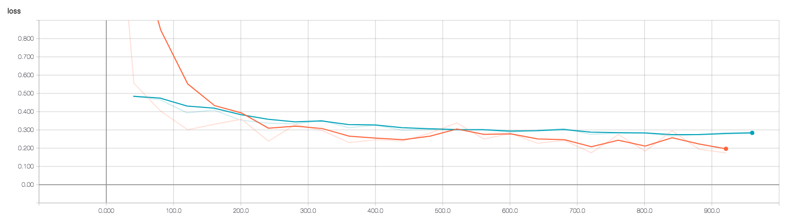
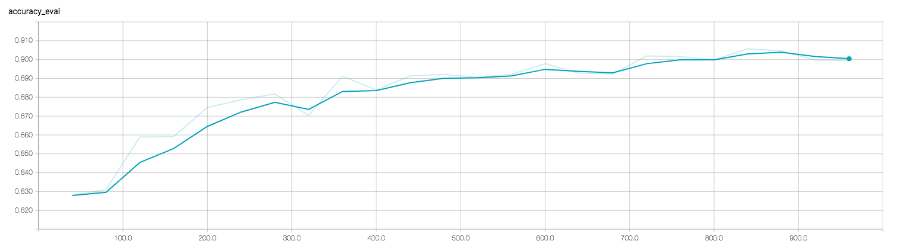
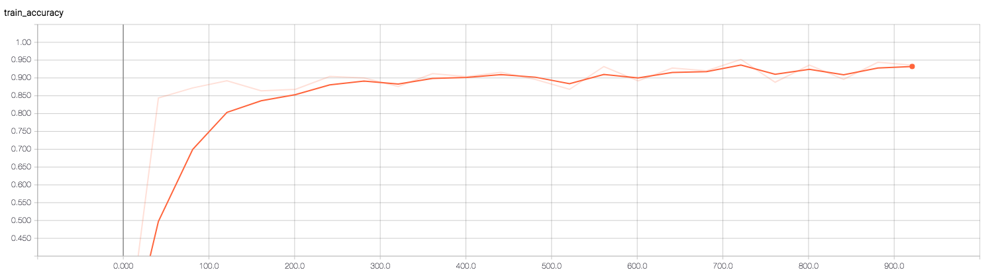

## Experiments with Fashion-MNIST

### Dependencies
python 3.6.5, argparse 1.1, numpy 1.14, tensorflow 1.10, Pillow 5.2.0

Or simply run `pip3 install -r requirements.txt`

### Running the script

#### Training from scratch

Run `python3 model.py --model-dir=<MODEL_DIR>`. This will train the model from scratch if `<MODEL_DIR>` is empty.
Model checkpoints and logs will be created in this folder

#### Resuming training

Run `python3 model.py --model-dir=<MODEL_DIR>`. This will continue training from the latest checkpoint in `<MODEL_DIR>`

#### Running inference on an image

Run `python3 model.py --model-dir=<MODEL_DIR> --input-img=<IMAGE_FILE_PATH>`. Pretrained checkpoint is given in `pretrained` directory.

E.g 

`python3 model.py --input-img=test_imgs/2.png`

would output

`Predicted class: Pullover`

### Approach taken

#### Model architecture

Layer | Output Shape
--- | --- |
Input layer | (BATCH_SIZE, 28, 28, 1)
conv1 (with elu) | (BATCH_SIZE, 28, 28, 64)
pool1 | (BATCH_SIZE, 14, 14, 64)
conv2 (with elu) | (BATCH_SIZE, 14, 14, 64)
pool2 | (BATCH_SIZE, 7, 7, 64)
pool2_flat | (BATCH_SIZE, 3136)
dense | (BATCH_SIZE, 1024)
logits | (BATCH_SIZE, 10)

#### Training

Model is trained with batch size of 250 over 4 epochs using Adam optimizer, with default hyper-parameters (learning_rate=0.001, beta1=0.9, beta2=0.999, epsilon=1e-08).
Softmax cross entropy is used as the loss function.

#### Logging

Training accuracy, loss & precision are logged using the standard interval. Evaluation accuracy, loss & precision
are logged every 40 training steps.

All the metrics can be inspected by accessing Tensorboard using `tensorboard --logdir=<MODEL_DIR>`

### Analysis

#### Training loss vs Evaluation loss over time

Blue line indicates validation loss, while orange line indicate training loss.
The final evaluation loss after training is 0.28, while final training loss is 0.17. 

#### Training accuracy vs Evaluation accuracy over time

Training accuracy over time:

Evaluation accuracy over time:

The final training accuracy is 0.93, versus evaluation accuracy of 0.90. 
The accuracies appear close enough so there is few sign of overfitting.
